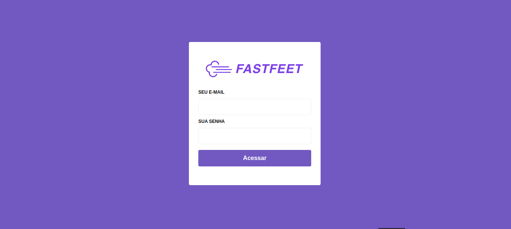
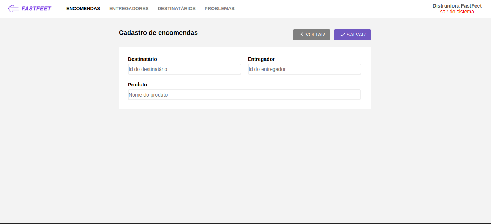
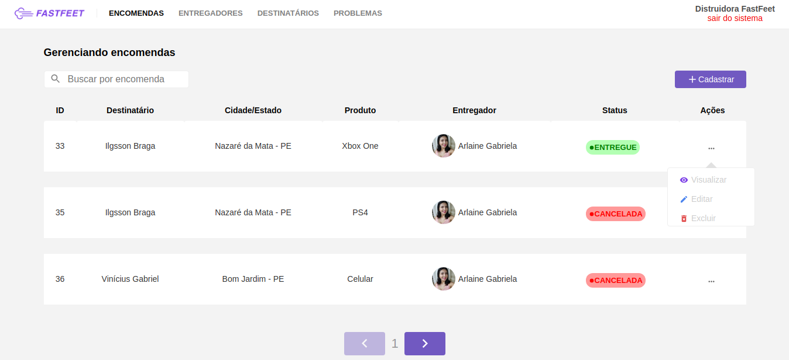
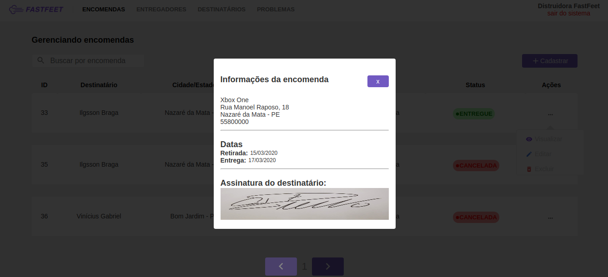
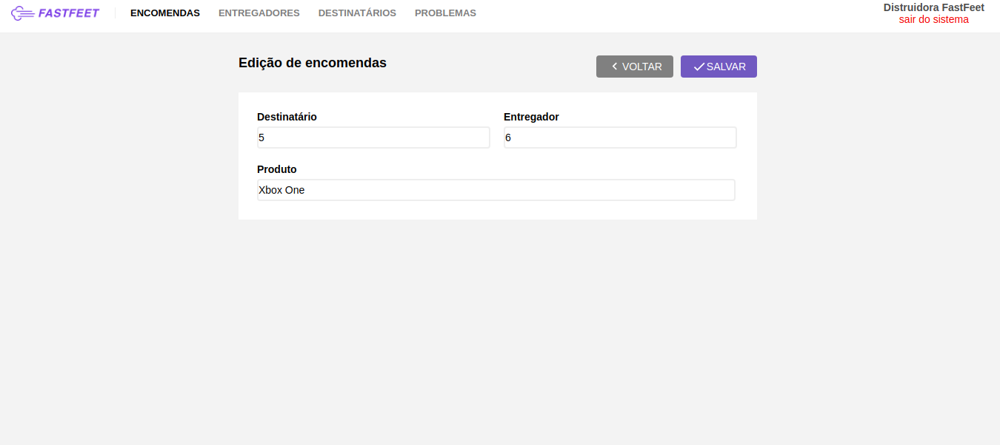
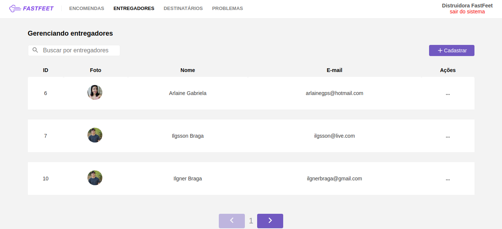
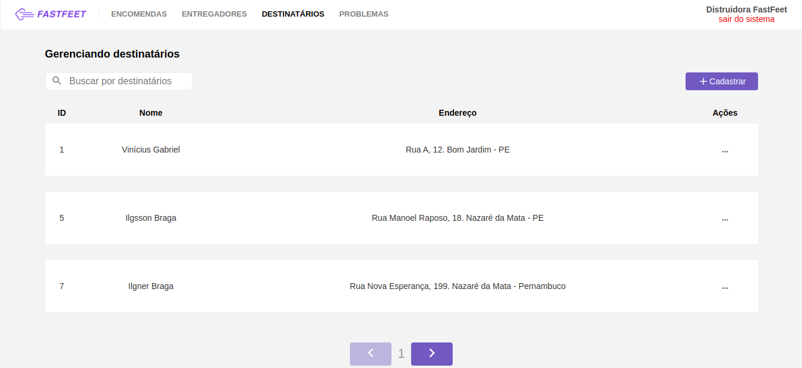
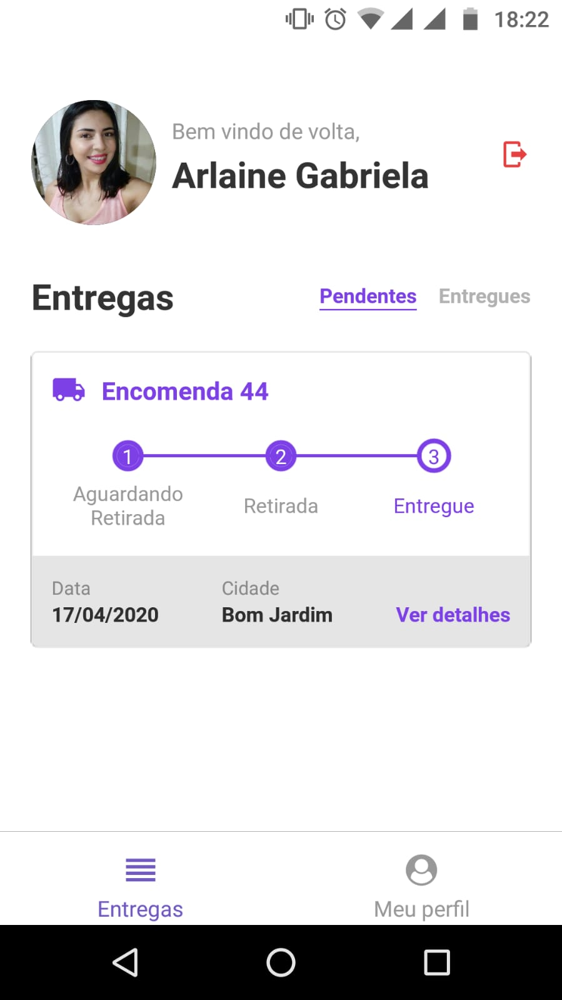
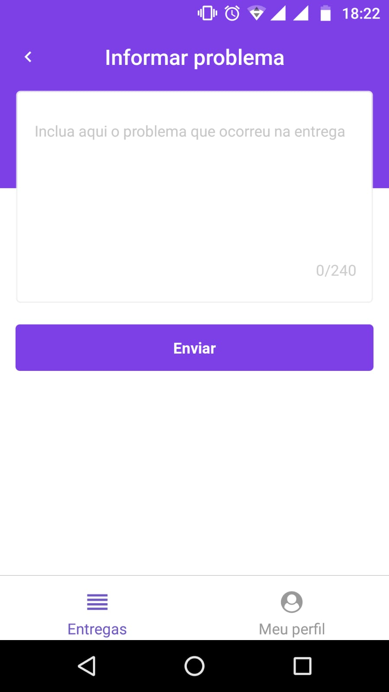
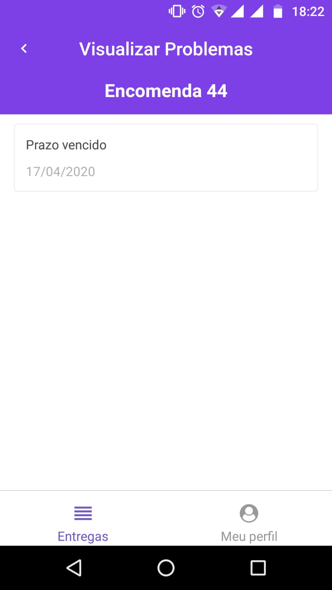

# About

 Application made during the Bootcamp GoStack 10. This is a application for a fictitious carrier. The Backend was made with Node.JS, Frontend Web with ReactJS and mobile with React Native. 
Below some of the technologies used: 

<ul>
  <a href="https://classic.yarnpkg.com/pt-BR/package/express"><li>ExpressJS</li></a>
  <a href="https://sentry.io/organizations/ilgssonbraga/issues/"><li>Sentry</li></a>
  <a href="https://github.com/bee-queue/bee-queue"><li>Bee Queue</li></a>
  <a href="https://mailtrap.io/"><li>Mailtrap</li></a>
  <a href="https://classic.yarnpkg.com/pt-BR/package/redis"><li>Redis</li></a>
  <a href="https://www.docker.com/"><li>Docker</li></a>
  <a href="https://classic.yarnpkg.com/pt-BR/package/jsonwebtoken"><li>JSON Web Token</li></a>
  <a href="https://classic.yarnpkg.com/pt-BR/package/multer"><li>Multer</li></a>
  <a href="https://classic.yarnpkg.com/pt-BR/package/sequelize"><li>Postgres with Sequelize</li></a>
  <a href="https://classic.yarnpkg.com/pt-BR/package/yup"><li>Yup</li></a>
  <a href="https://classic.yarnpkg.com/pt-BR/package/axios"><li>Axios</li></a>
  <a href="https://classic.yarnpkg.com/pt-BR/package/immer"><li>Immer</li></a>
  <a href="https://classic.yarnpkg.com/pt-BR/package/redux"><li>Redux</li></a>
  <a href="https://classic.yarnpkg.com/pt-BR/package/redux-saga"><li>Redux Saga</li></a>
  <a href="https://classic.yarnpkg.com/pt-BR/package/reactotron-react-js"><li>Reactotron</li></a>
  <a href="https://classic.yarnpkg.com/pt-BR/package/prop-types"><li>Prop Types</li></a>
  <a href="https://classic.yarnpkg.com/pt-BR/package/styled-components"><li>Styled Components</li></a>
  <a href="https://classic.yarnpkg.com/pt-BR/package/react-navigation"><li>React Navigation 4x</li></a>
  <a href="https://classic.yarnpkg.com/pt-BR/package/react-icons"><li>React Icons</li></a>
  <a href="https://classic.yarnpkg.com/pt-BR/package/react-native-vector-icons"><li>React Native Vector Icons</li></a>
</ul>

## WEB

## Mobile

